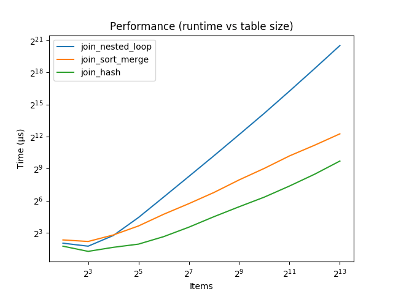

Join Algorithms
===============

This project explores the comparative performance of the following join algorithms:

- [ested loop](https://en.wikipedia.org/wiki/Nested_loop_join)
- [Sort-merge](https://en.wikipedia.org/wiki/Sort-merge_join)
- [Hash](https://en.wikipedia.org/wiki/Hash_join)

Overview
--------

The join.py file provides a scaffold and doctests for 3 functions that implement these algorithms.

When run directly, the program will benchmark the performance of the algorithms and plot their runtime vs table size. The output should look something like this:

Assignment
----------

Implement the three join algorithms. You can verify their correctness using either:

`make`

or by directly calling:

`python3 -m doctest join.py`

Once you have the algorithms implemented, you may want to run `python3 join.py` to see their performance and/or experiment with them on your own to get a sense for how they perform with different input sizes.
